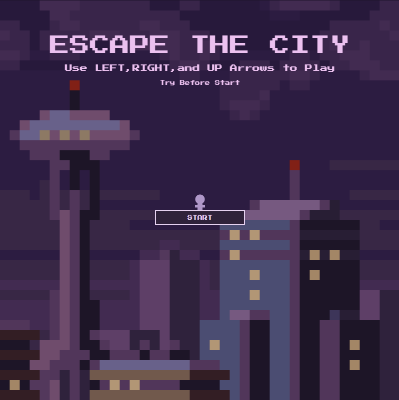

# 🌆 Escape the City

> A minimalist pixel-style platformer built with p5.js — climb, jump, and escape the shadows of the city.



---

## 🎮 Description

The city is dense, dark, and quiet—too quiet.  
You were never meant to stay.

Somewhere above the noise, the smoke, and the stone,  
there’s silence. There’s sky.  
You stack your way upward—alone, as the city disappears below.

---

## 🕹️ Controls

- `↑` or `SPACE` — Jump  
- `←` and `→` — Move left and right  
- Climb carefully. Reach the top without falling… or cheating.

---

## 💡 Features

- 🌆 Pixel-styled stacking escape game
- 🧠 Dynamic cheat detection (spacebar abuse punished)
- 🔄 Restartable flow with smooth transitions
- 🎨 Atmospheric visuals with silent narrative
- 🏁 Game Over and Victory screens

---

## 💻 Built With

- [p5.js](https://p5js.org/) – for rendering and input
- Vanilla HTML / JavaScript – no framework required
- [Press Start 2P](https://fonts.google.com/specimen/Press+Start+2P) – pixel-style font

---

## 🚀 Play Online

[▶ Try on GitHub Pages](https://youhuipang.github.io/ESCAPE-THE-CITY/)  
_(Make sure GitHub Pages is enabled in your repository settings)_

---

## 📁 Run Locally

1. Clone this repository:
   ```bash
   git clone https://github.com/YouhuiPang/ESCAPE-THE-CITY.git
   ```
2. Open `index.html` in your browser

---

## 📷 Screenshot

> *(Replace the image below with your own screenshot)*


---

## 📄 License

This project is licensed under the MIT License.  
Feel free to remix, expand, or adapt it — just don’t forget to climb honestly. 😉

---

## ✨ Author

Developed by **Youhui Pang**  
Designed with love for pixels, patience, and poetic silence.
